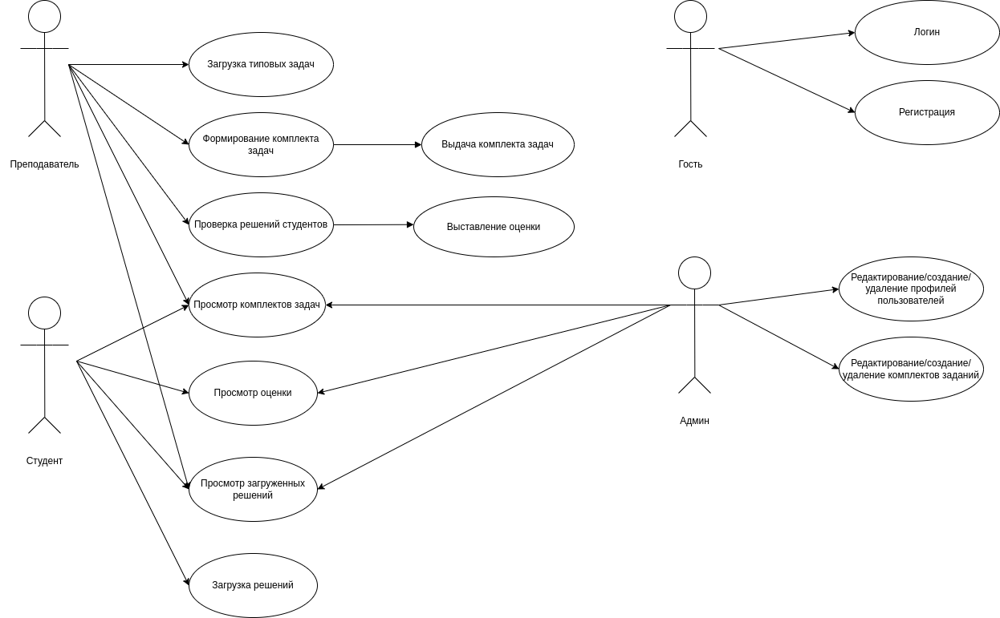
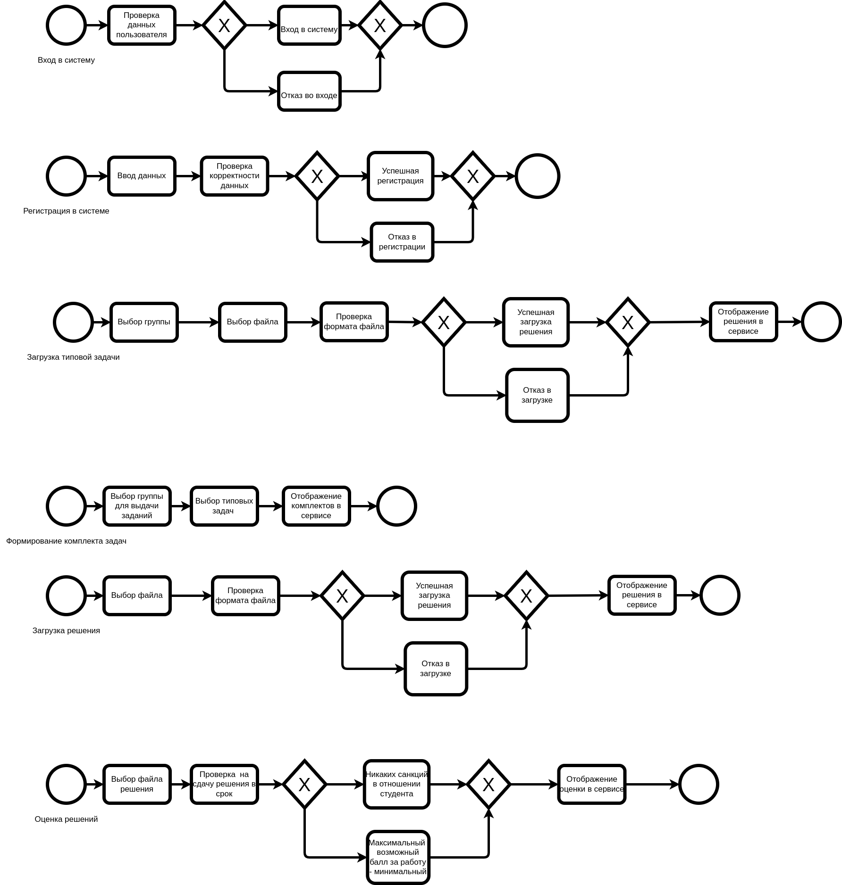
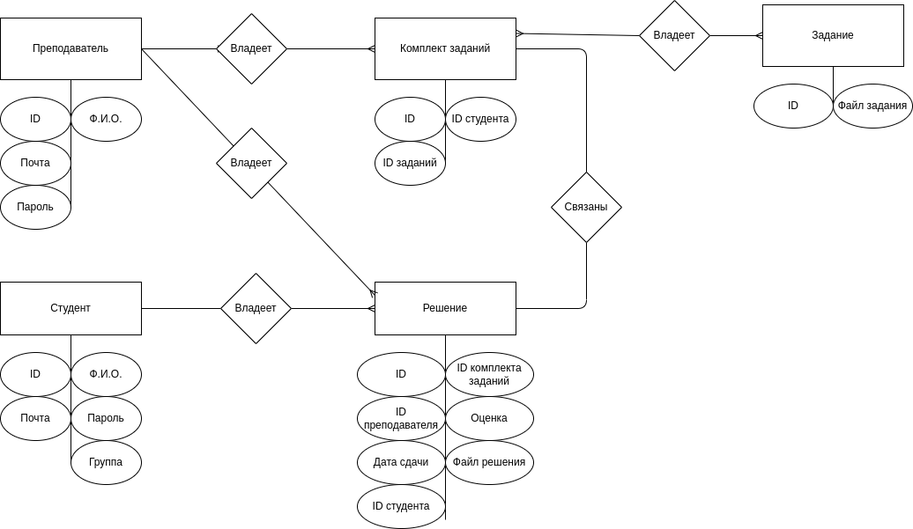
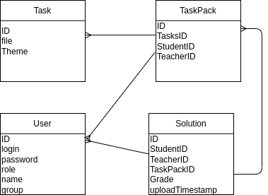

# Лабораторная работа 1

## 1. Цель работы
  Целью работы является создание web-приложения, для хранения, просмотра и работы с комплектами выданных студентам заданий.

## 2. Функционал
   1. Регистрация
   2. Авторизация
   3. Просмотр комплектов заданий
   4. Оценка отправленных решений
   5. Отправка решений
   6. Составление комплектов заданий
   7. Загрузка заданий, из которых в дальнейшем создаются комплекты
   8. Просмотр отправленных решений
   9. Просмотр заданий

## 3. Use-Case диаграмма

## 4. BPMN

## 5. Основные пользовательские сценарии

Неавторизированный пользователь может только авторизоваться или зарегистрироваться.

Авторизированный пользователь может выполнить все теже действия, что и неавторизированный пользователь, авторизованные пользователи делятся на роли - преподаватели, администраторы и студенты.

Преподаватели могут загружать задания, создавать и просматривать комплекты заданий, просматривать и оценивать решения студентов.

Студенты могут просматривать комплекты заданий, просматривать и загружать их решения.

Администраторы могут просматривать\создавать\удалять\изменять профили пользователей, комплекты заданий, решения студентов.

## 6. ER-диаграмма

## 7. Диаграмма БД

## 8. Компонентная диаграмма системы

