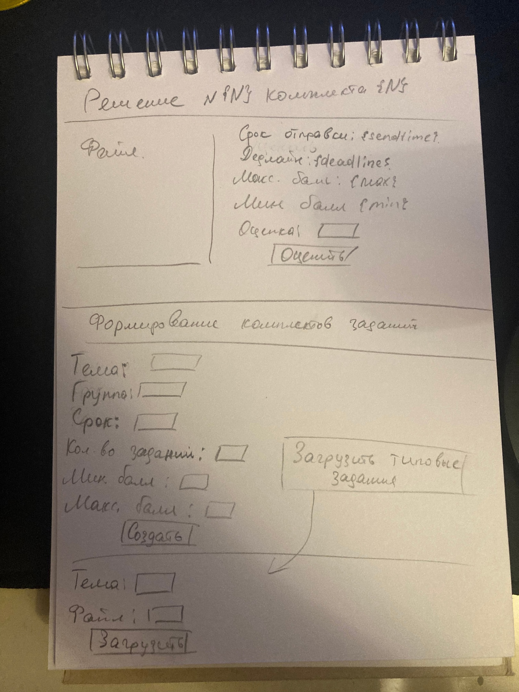

# Лабораторная работа 1

## 1. Цель работы
  Целью работы является создание web-приложения, для хранения, просмотра и работы с комплектами выданных студентам заданий.

## 2. Функционал
   1. Регистрация
   2. Авторизация
   3. Просмотр комплектов заданий
   4. Оценка отправленных решений
   5. Отправка решений
   6. Составление комплектов заданий
   7. Загрузка заданий, из которых в дальнейшем создаются комплекты
   8. Просмотр отправленных решений
   9. Просмотр заданий

## 3. Use-Case диаграмма

## 4. BPMN

## 5. Основные пользовательские сценарии

Неавторизированный пользователь может только авторизоваться или зарегистрироваться.

Авторизированный пользователь может выполнить все теже действия, что и неавторизированный пользователь, авторизованные пользователи делятся на роли - преподаватели, администраторы и студенты.

Преподаватели могут загружать задания, создавать и просматривать комплекты заданий, просматривать и оценивать решения студентов.

Студенты могут просматривать комплекты заданий, просматривать и загружать их решения.

Администраторы могут просматривать\создавать\удалять\изменять профили пользователей, комплекты заданий, решения студентов.

## 6. ER-диаграмма

## 7. Диаграмма БД

## 8. Компонентная диаграмма системы

## 9. Черновые эксизы страниц

## 10. Nginx benchmark

# С балансировкой

ab -n 4000 -c 100 http://localhost:8888/api/v1/
This is ApacheBench, Version 2.3 <$Revision: 1879490 $>
Copyright 1996 Adam Twiss, Zeus Technology Ltd, http://www.zeustech.net/
Licensed to The Apache Software Foundation, http://www.apache.org/

Benchmarking localhost (be patient)
Completed 400 requests
Completed 800 requests
Completed 1200 requests
Completed 1600 requests
Completed 2000 requests
Completed 2400 requests
Completed 2800 requests
Completed 3200 requests
Completed 3600 requests
Completed 4000 requests
Finished 4000 requests

Server Software:        nginx/1.18.0
Server Hostname:        localhost
Server Port:            8888

Document Path:          /api/v1/
Document Length:        2142 bytes

Concurrency Level:      100
Time taken for tests:   61.047 seconds
Complete requests:      4000
Failed requests:        28
   (Connect: 0, Receive: 0, Length: 28, Exceptions: 0)
Non-2xx responses:      28
Total transferred:      10698844 bytes
HTML transferred:       8512672 bytes
Requests per second:    65.52 [#/sec] (mean)
Time per request:       1526.171 [ms] (mean)
Time per request:       15.262 [ms] (mean, across all concurrent requests)
Transfer rate:          171.15 [Kbytes/sec] received

Connection Times (ms)
              min  mean[+/-sd] median   max
Connect:        0    0   0.7      0       6
Processing:    11  951 6052.8    236   61035
Waiting:        5  951 6052.8    236   61035
Total:         11  951 6053.2    236   61039

Percentage of the requests served within a certain time (ms)
  50%    236
  66%    287
  75%    296
  80%    299
  90%    314
  95%    372
  98%   1353
  99%  27720
 100%  61039 (longest request)

# Без балансировки

This is ApacheBench, Version 2.3 <$Revision: 1879490 $>
Copyright 1996 Adam Twiss, Zeus Technology Ltd, http://www.zeustech.net/
Licensed to The Apache Software Foundation, http://www.apache.org/

Benchmarking localhost (be patient)
Completed 400 requests
Completed 800 requests
Completed 1200 requests
Completed 1600 requests
Completed 2000 requests
Completed 2400 requests
Completed 2800 requests
Completed 3200 requests
Completed 3600 requests
Completed 4000 requests
Finished 4000 requests

Server Software:        nginx/1.18.0
Server Hostname:        localhost
Server Port:            8888

Document Path:          /api/v1/
Document Length:        2142 bytes

Concurrency Level:      100
Time taken for tests:   61.020 seconds
Complete requests:      4000
Failed requests:        5
   (Connect: 0, Receive: 0, Length: 5, Exceptions: 0)
Non-2xx responses:      5
Total transferred:      10752440 bytes
HTML transferred:       8558170 bytes
Requests per second:    65.55 [#/sec] (mean)
Time per request:       1525.500 [ms] (mean)
Time per request:       15.255 [ms] (mean, across all concurrent requests)
Transfer rate:          172.08 [Kbytes/sec] received

Connection Times (ms)
              min  mean[+/-sd] median   max
Connect:        0    0   0.6      0       6
Processing:    11  739 3945.5    382   61008
Waiting:        6  739 3945.5    382   61008
Total:         11  739 3945.8    382   61011

Percentage of the requests served within a certain time (ms)
  50%    382
  66%    419
  75%    429
  80%    435
  90%    461
  95%    527
  98%   1328
  99%   8169
 100%  61011 (longest request)

ab -n 1000 -c 100 -g out.data http://localhost:8888/api/v1/

# С балансировкой

Server Software:        nginx/1.18.0
Server Hostname:        localhost
Server Port:            8888

Document Path:          /api/v1/
Document Length:        2142 bytes

Concurrency Level:      100
Time taken for tests:   61.028 seconds
Complete requests:      1000
Failed requests:        13
   (Connect: 0, Receive: 0, Length: 13, Exceptions: 0)
Non-2xx responses:      13
Total transferred:      2660749 bytes
HTML transferred:       2116312 bytes
Requests per second:    16.39 [#/sec] (mean)
Time per request:       6102.752 [ms] (mean)
Time per request:       61.028 [ms] (mean, across all concurrent requests)
Transfer rate:          42.58 [Kbytes/sec] received

Connection Times (ms)
              min  mean[+/-sd] median   max
Connect:        0    0   0.9      0       4
Processing:     9 2207 9392.0    100   61017
Waiting:        5 2207 9392.0    100   61017
Total:          9 2208 9392.5    100   61020

Percentage of the requests served within a certain time (ms)
  50%    100
  66%    111
  75%    122
  80%    133
  90%   1328
  95%   7627
  98%  54213
  99%  61019
 100%  61020 (longest request)

# Без балансировки

Server Software:        nginx/1.18.0
Server Hostname:        localhost
Server Port:            8888

Document Path:          /api/v1/
Document Length:        2142 bytes

Concurrency Level:      100
Time taken for tests:   61.038 seconds
Complete requests:      1000
Failed requests:        20
   (Connect: 0, Receive: 0, Length: 20, Exceptions: 0)
Non-2xx responses:      20
Total transferred:      2644460 bytes
HTML transferred:       2102480 bytes
Requests per second:    16.38 [#/sec] (mean)
Time per request:       6103.843 [ms] (mean)
Time per request:       61.038 [ms] (mean, across all concurrent requests)
Transfer rate:          42.31 [Kbytes/sec] received

Connection Times (ms)
              min  mean[+/-sd] median   max
Connect:        0    0   1.1      0       5
Processing:    10 2589 10640.5     96   61027
Waiting:        5 2589 10640.4     96   61027
Total:         10 2590 10641.2     97   61031

Percentage of the requests served within a certain time (ms)
  50%     97
  66%    111
  75%    122
  80%    133
  90%   1126
  95%  14249
  98%  61029
  99%  61031
 100%  61031 (longest request)
